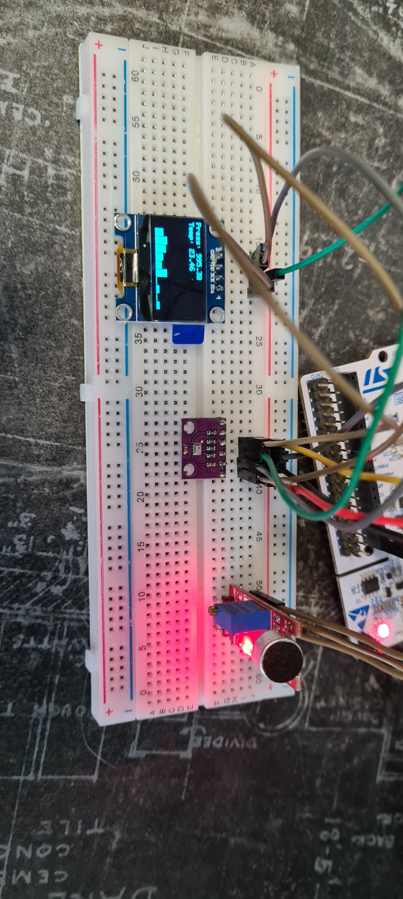

# OLED visualization

The project goal was to create OLED screen library and display some data on it. Therefore OLED screen and 2 sensors were combined into application:
- BMP280 sensor to measure temperature and pressure.
- Microphone with sound sensor KY037 to measure sound and then calculate FFT to display certain frequencies.
Whole application was run on STM32F411RE Nucleo board. To calculate FFT much faster, arm math function was added to project.
To draw shapes and texts on OLED, a GFX_BW library was added. Its a library based on adafruit library dedicated to these OLEDs.
- SSD1306 OLED monochromatic screen to display BMP280 data as values and microphone FFT frequencies as columns chart.

[

    

    Wired components

## Programming

##### Whole program was written with a use of HAL library. Each functionality is in seperate files in My_library folder:
- BMP280.c/h
- GFX_BW.c/h 
- logo.c/h 
- SSD1306_OLED.c/h 
- fonts

Used peripheriales:
- ADC
    - Read data from microphone 
- DMA
    - Handle ADC operation
- Timers 
    - Trigger ADC conversion start to measure data with frequency ~44.1 kHz
- I2C
	- BMP280 communication
  - OLED communication
 
## Software

- STM32CubeIDE with built-in CubeMX ver 1.14.1 - programming and configuration

## Peripherals documentation

[BMP280](https://cdn-shop.adafruit.com/datasheets/BST-BMP280-DS001-11.pdf)

[SSD1306](https://cdn-shop.adafruit.com/datasheets/SSD1306.pdf)

[Microphone KY037](https://datasheetspdf.com/pdf-file/1402047/Joy-IT/KY-037/1)